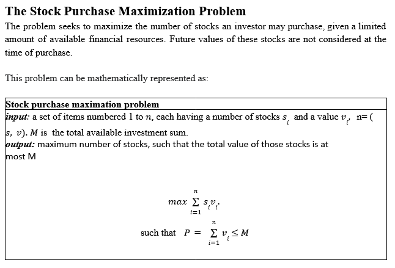

## Team members
- Authors: [Jacob Armstrong] & [Haroutyun Chamelian] & [Phu Lam]
- Emails: [jarmstrong31@csu.fullerton.edu] & [] & []


## Problem Statement


## Introduction

This project seeks to maximize the number of stocks an investor may purchase, given a limited amount of available financial resources. Future values of these stocks are not considered at the time of purchase. Two approaches (exhaustive search & dynamic programming) are implemented.

## Setup and Running

### Prerequisites

- Python 3.x

### Instructions

1. Ensure you have Python installed on your machine.
2. Clone or download this repository.
3. Navigate to the directory containing `Exhaustive_Search.py` and `Dynamic_Programming.py`.
4. Run the Python scripts using these commands:
```bash
python Exhaustive_Search.py
python Dynamic_Programming.py
```